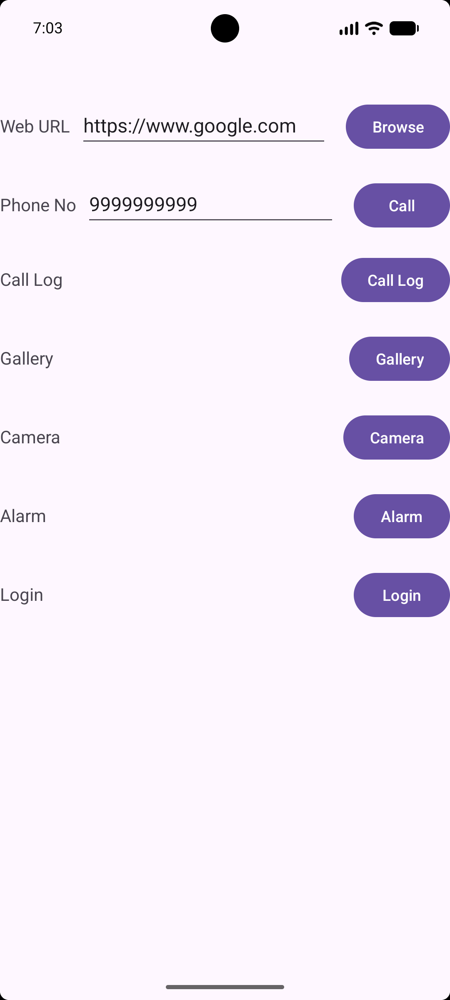
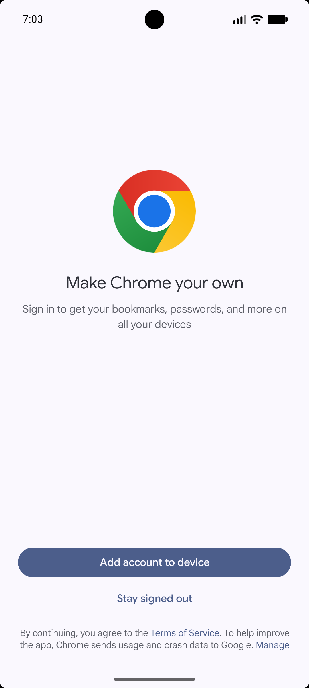
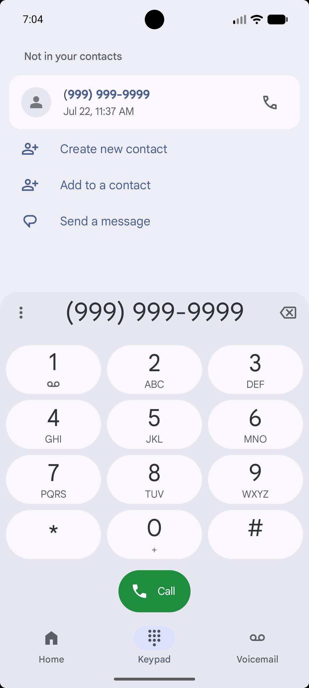
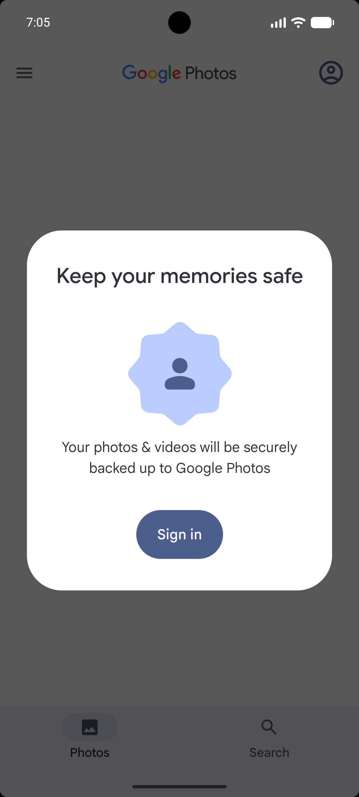
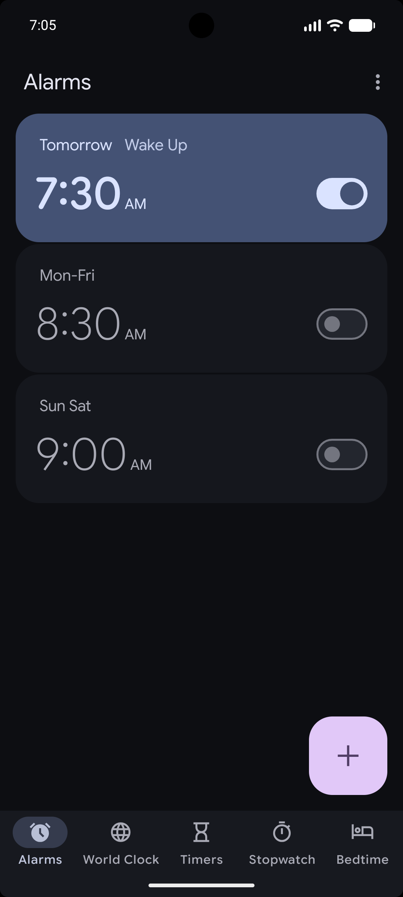

# MAD Practical 3 - Implicit & Explicit Intents in Android

A modern Android application developed using **Kotlin** demonstrating the concepts and usage of **Implicit Intents** (system app actions like Web Browsing, Dialing, Call Logs, Gallery, Camera, Alarms) and **Explicit Intents** (Activity Navigation to Login Screen).

---

## 📌 Student Details
* **Enrollment No:** `24012011115`
* **Submitted by:** Nishit Patel
* **Course:** Mobile Application Development (MAD)
* **Practical:** Practical Assignment 3

---

## 🚀 Features & Actions

### 1. Implicit Intents (`MainActivity`)
- 🌐 **Web Browser:** Opens any web URL in the device's default browser (`Intent.ACTION_VIEW`).
- 📞 **Phone Dialer:** Dials a target phone number using the phone dialer (`Intent.ACTION_DIAL`).
- 📋 **Call Log Viewer:** Opens system call logs (`CallLog.Calls.CONTENT_URI`) with dynamic `READ_CALL_LOG` runtime permission handling.
- 🖼️ **Gallery:** Opens the device image gallery (`MediaStore.Images.Media.EXTERNAL_CONTENT_URI`).
- 📷 **Camera:** Triggers default camera application for photo capture (`MediaStore.ACTION_IMAGE_CAPTURE`).
- ⏰ **Set Alarm:** Programmatically sets an alarm for 07:30 AM ("Wake Up") via `AlarmClock.ACTION_SET_ALARM`.

### 2. Explicit Intents (`LoginActivity`)
- 🔑 **Activity Navigation:** Navigates directly from `MainActivity` to `LoginActivity` using explicit target class intent (`Intent(this, LoginActivity::class.java)`).
- 🎨 **Custom Material Login UI:** Styled with Material 3 components (`MaterialCardView`, rounded input containers, custom buttons) and displays feedback Toast notification on login action.

---

## 🛠️ Tech Stack & Requirements

* **Language:** Kotlin
* **Minimum SDK:** API 24 (Android 7.0 Nougat)
* **Compile / Target SDK:** API 36 (Android 15)
* **UI Components:** `ConstraintLayout`, `MaterialCardView`, `MaterialButton`
* **Permissions:**
  * `android.permission.READ_CALL_LOG`
  * `com.android.alarm.permission.SET_ALARM`

---

## 📱 Application Screenshots (In Execution Order)

<table align="center">
  <tr>
    <td align="center" valign="top" width="33%">
      <h3>1. Main Home Screen</h3>
      <p>Primary landing activity displaying options for implicit & explicit intents.</p>
      
    </td>
    <td align="center" valign="top" width="33%">
      <h3>2. Web URL Browse Action</h3>
      <p>Navigates to <code>https://www.google.com</code> using default browser.</p>
      
    </td>
    <td align="center" valign="top" width="33%">
      <h3>3. Phone Dialer Action</h3>
      <p>Opens dialer with pre-filled phone number ready to call.</p>
      
    </td>
  </tr>
  <tr>
    <td align="center" valign="top" width="33%">
      <h3>4. Photos / Gallery</h3>
      <p>Launches Gallery / Photos app to view media files.</p>
      
    </td>
    <td align="center" valign="top" width="33%">
      <h3>5. Camera Action</h3>
      <p>Opens camera application to capture a new photo.</p>
      
    </td>
    <td align="center" valign="top" width="33%">
      <h3>6. Alarm Action</h3>
      <p>Schedules alarm for 7:30 AM with title "Wake Up".</p>
      
    </td>
  </tr>
  <tr>
    <td align="center" valign="top" colspan="3">
      <h3>7. GUNI Login Activity</h3>
      <p>Explicitly opens <code>LoginActivity</code> displaying Material Login UI.</p>
      
    </td>
  </tr>
</table>


## 📥 How to Clone & Run

1. **Clone the Repository:**
   ```bash
   git clone https://github.com/Nishit079/24012011115_MAD_Practical3.git
   ```

2. **Open in Android Studio:**
   * Launch **Android Studio**.
   * Select **File > Open** and select the cloned project folder (`24012011115_MAD_Practical3`).

3. **Build & Run:**
   * Let Gradle sync dependencies automatically.
   * Select an Emulator or connected Physical Device (Android API 24+).
   * Click **Run (Shift + F10)**.

---

**Submitted by Nishit Patel**  
**Enrollment No: 24012011115**
